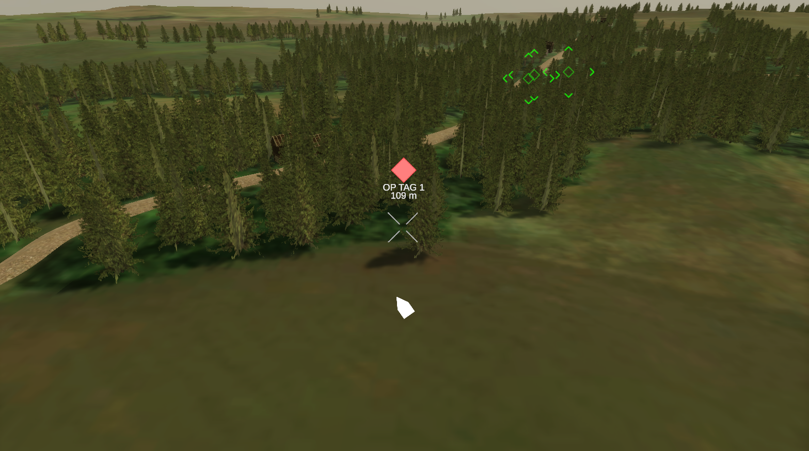
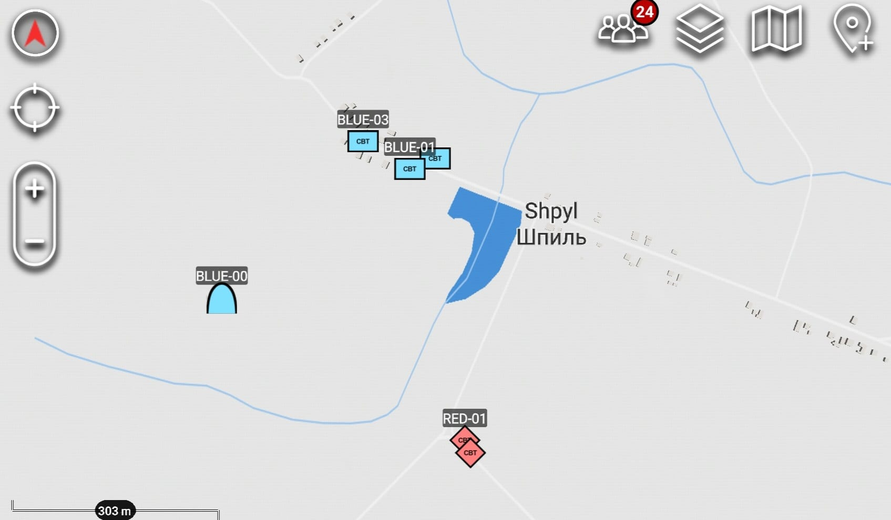

# Unity Military Simulation with Integrated CIV-TAK Communication

A Unity simulation of AI-controlled ground units and a flyable reconnaissance drone on a georeferenced 3D terrain, connected in real time to TAK (Tactical Assault Kit) client software over the Cursor-on-Target (CoT) protocol. Vehicles and the drone appear as live, moving markers on a real TAK client (e.g. ATAK-CIV); markers an operator places in TAK are sent back and appear in the simulation upon broadcast. Originally a bachelor's thesis, the same codebase is being extended for a master's thesis.

> 
> 

---

## Feature overview

- AI-controlled vehicles patrol, chase, and engage based on faction and line of sight.
- A flyable drone with its own camera and HUD acts as a scout — it's what actually spots hostile units.
- Every entity's position is translated from the Unity scene into real-world GPS coordinates and streamed to a TAK client, so it shows up on a real situational-awareness map, not just inside Unity.
- The terrain is a hand-built, georeferenced recreation of a real village (Shpyl, Ukraine).
- Markers an operator places on the TAK side get sent back and appear in the 3D scene.

## Tech stack

| Layer | Tech |
|---|---|
| Engine | Unity 2022.3.11f1, HDRP |
| Language | C# |
| AI / navigation | Unity NavMesh |
| Networking | TCP sockets, Cursor-on-Target (CoT) XML |
| TAK backend | [FreeTAKServer](https://github.com/FreeTAKTeam/FreeTAKServer), run via Docker |
| Terrain sourcing (external) | BlenderGIS |

## Status

Feature-complete demo. Expect incremental fixes to the codebase rather than major changes.

## Tested results

- **Georeferencing accuracy**: ~4 m average error, ~6 m worst case, measured against real-world checkpoints (system reports generated marker accuracy as 10 m)
- **Latency**: well under a tenth of a second from a position update in Unity to it reaching a TAK client.
- **Performance impact**: negligible; frame time is effectively unchanged with the networking active.
- **Resilience**: the simulation survives the relay server going down and reconnects on its own once it's back.
- **Known limitation**: deleting an entity doesn't remove its marker from the TAK client in real time — this appears to be due to the client not acting on delete messages, not an issue in this codebase. Generated markers disappear eventually via timeout.

## Setup

### 1. Prerequisites

- Unity Hub with **Unity 2022.3.11f1** (HDRP projects are sensitive to editor version)
- Docker Desktop (for FreeTAKServer)

### 2. Run FreeTAKServer (Docker)

```powershell
docker pull ghcr.io/freetakteam/freetakserver:latest
docker pull ghcr.io/freetakteam/ui:latest
```

Use the corrected compose file in [`docs/freetakserver-setup.md`](Docs/freetakserver-setup.md) — I had problems with the default configuration. Then:

```powershell
docker compose -f compose.yaml up -d
```

Verify: CoT TCP at `localhost:8087` (this is what Unity connects to). Full setup and the corrected `compose.yaml` are in [`docs/freetakserver-setup.md`](docs/freetakserver-setup.md).

> This project only uses FTS's CoT TCP connection, not its REST API — the REST API was unreliable in testing and isn't used here.

### 3. Open the project

1. Open the repo root in Unity Hub with 2022.3.11f1.
2. Open the main scene: `Assets/Scenes/Shpyl Terrain.unity`.
3. On the `CoordinateConverter` component, confirm the anchor `latitude`/`longitude`/HAE fields are set (it warns on startup if left at `0, 0`).
4. On the `CotSender` component, confirm the TCP target matches your FTS instance (defaults to `127.0.0.1:8087`).

### 4. Gameplay overview

Press Play. Units start broadcasting to FTS (sometimes it doesn't connect first try, just wait until it reconnects once); open a TAK client pointed at the same server to see the live markers.

## Usage

- Fly the drone to scout the terrain — units it spots get broadcast to TAK as hostile contacts; friendly units broadcast regardless of visibility.
    - WASD for horizontal movement, Q/E for left/right rotation and Shift/Left Control for up/down
- The in-Unity HUD shows the same markers a TAK operator sees, so you can compare the simulated view against the real TAK picture.
- On the TAK side, connect a client to the FTS instance to see units move live, and place operator markers that get pushed back into the Unity scene. For ATAK, operator markers must be manually broadcast via the Broadcast/Send button.
- Pressing Spacebar while looking at an enemy vehicle spawns a one-way attack drone at the nearest friendly vehicle
    - This is a feature left over from the bachelor's thesis work

## Third-party Assets
- Sourced mostly from the Unity Asset Store, and various CC0 asset repositories for textures and materials
- WarFX, Sketchfab importer, HDRP sample assets, terrain texture packs
- Abandoned buildings, Village houses pack
- ZIL 130 Military truck, Crosshairs, UX Flat Icons, Russian Military Vehicles

## Known problems

- No automated tests or CI yet.
- Entity deletion doesn't propagate to the TAK client in real time (see Tested results above).

## To-do
- Add LICENSE file

## Author

Built solo by Duje. Credits to the authors of the used third-party assets and FreeTAKServer.
